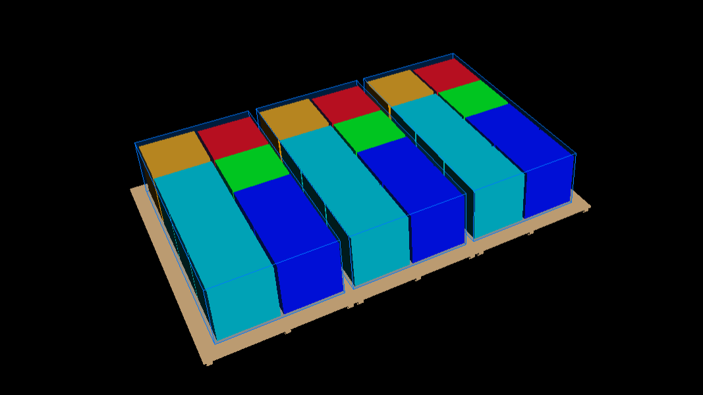
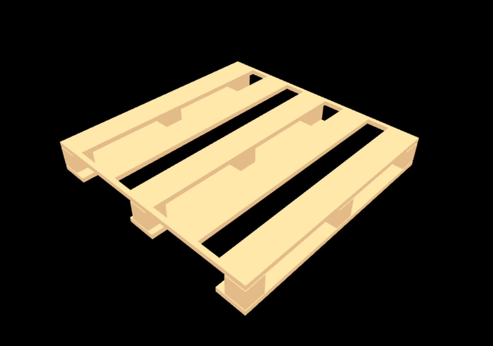
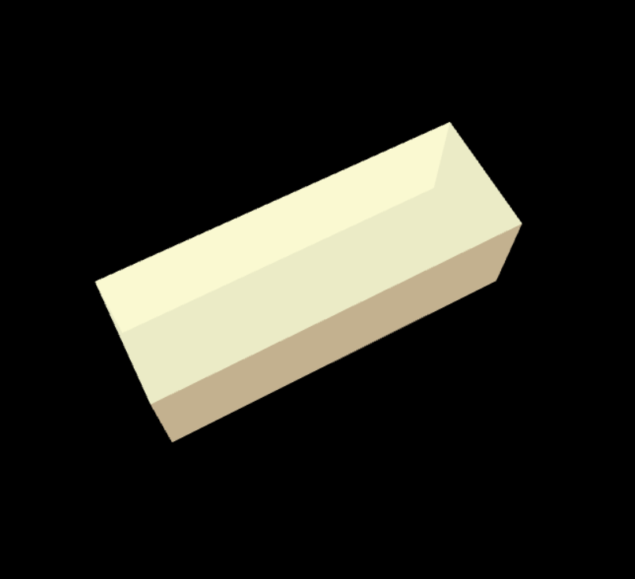

<!-- Add HTML tags for enriched view -->
<h1>3D Packing &amp; Carton Visualization</h1>

This project provides interactive 3D visualizations for:
<ul>
  <li>Industrial pallets (block type, 42&quot;x42&quot;)</li>
  <li>Carton boxes (bottom lock, with open flaps)</li>
  <li>Packing layouts with containers and items</li>
</ul>

<h2>Features</h2>
<ul>
  <li><b>Viewer:</b> Visualizes containers and items from <code>layout.json</code> in 3D (<code>Viewer.html</code>)
     
    
  </li>
  <li><b>Pallet:</b> Shows a standard 42&quot;x42&quot; block pallet in 3D (<code>pallet.html</code>)
     
    
  </li>
  <li><b>Carton:</b> Shows a bottom lock carton box with open top flaps (<code>cartons.html</code>)
     
    
  </li>
  <li><b>Legend:</b> Color-coded items with a legend for easy identification</li>
  <li><b>Interactive:</b> Orbit, zoom, and pan with mouse controls</li>
</ul>

<h2>Usage</h2>
<ol>
  <li>Open any HTML file (<code>Viewer.html</code>, <code>pallet.html</code>, <code>cartons.html</code>) in a modern web browser.</li>
  <li>For <code>Viewer.html</code>, edit <code>layout.json</code> to define containers and items.</li>
  <li>Use mouse to rotate, zoom, and pan the 3D scene.</li>
</ol>

<h2>File Overview</h2>
<ul>
  <li><code>Viewer.html</code> — Main 3D packing viewer, reads <code>layout.json</code></li>
  <li><code>pallet.html</code> — 3D visualization of a standard block pallet (42"x42")</li>
  <li><code>cartons.html</code> — 3D visualization of a bottom lock carton with open flaps</li>
  <li><code>layout.json</code> — Data file for containers and items (used by <code>Viewer.html</code>)</li>
</ul>

<h2>Requirements</h2>
<ul>
  <li>No installation needed. All dependencies are loaded via CDN.</li>
  <li>Works in any modern browser with WebGL support.</li>
</ul>

<h2>Customization</h2>
<ul>
  <li><b>layout.json:</b>
    <ul>
      <li>Add multiple containers and items.</li>
      <li>Assign items to containers using the <code>boxId</code> property.</li>
    </ul>
  </li>
  <li><b>Colors:</b>
    <ul>
      <li>Item colors can be set in <code>layout.json</code> or will use a default palette.</li>
    </ul>
  </li>
</ul>

<h2>Credits</h2>
<ul>
  <li><a href="https://threejs.org/">three.js</a> for 3D rendering</li>
</ul>

<i>Created for industrial packaging and visualization needs.</i>

